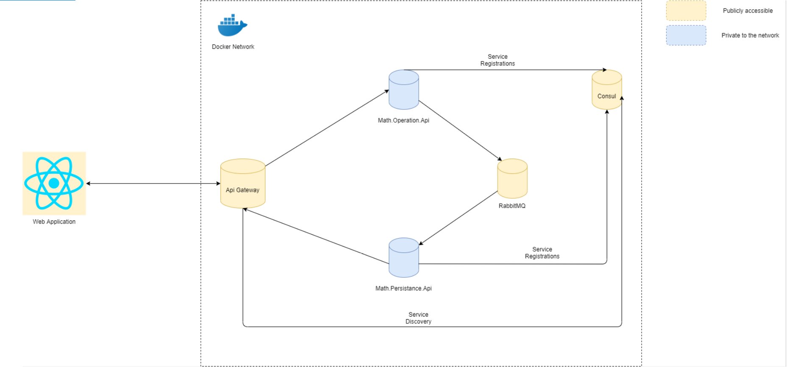

# High Level Diagram

## Technology Stack
   ### Tools
1.	Docker for Window (v2.3.5.1)
2.	Visual Studio Code
3.	Visual Studio (Not necessary)
   ### Backend
1.	.Net Core 3.1
2.	RabbitMQ
3.	Ocelot Api-Gateway
4.	Consul (for Service Discovery)
   ### Frontend
1.	React Js (Required node v12.13 & npm v6.12.0)
## Overview
In this application we are demonstrating a sample microservice architecture in .Net Core. Where we have used the RabbitMQ as message broker to establish the communication between the two microservice. Consul for the service registry and discovery. 
Apart from this, we have used the consul for the service discovery and Ocelot as API Gateway.
Project Deployment Architecture
 
This project will deploy on the docker. And following containers will be required to run this application.
Pre-Deployment Infrastructure Required
1.	Container that runs the consul.
2.	Container that runs RabbitMQ Service.
For this we have created a docker composer file (infra.yml), In which we have configure the required things for both above listed service.

## Application Deployment
1.	Container for API Gateway.
2.	Container for Math.Operation.Api.
3.	Container for Math.Persistance.Api.
4.	Container for the Web application (React SPA).

For this we have created a docker composer file (deploy.yml), In which we have configure the required things for both above listed service.
Project Component Working
#### Math.Operation.Api
This api has one single method that will perform the sum operation on the two numbers passed from the Front-End. 
	Math.Persistance.Api
This api will take the input from the Operation Api via message broker (RabbitMQ). And save the result in the file system.	
#### Message Broker
This will be used to establish the communication between the two services. We can also use the HttpClient as well but that will break in case if we have huge transaction coming up in future.
Consul	
	This is used to register the service for the discovery and their health status. 
#### Math.ApiGateway
This service will be the interface for the back-end services. This will take the input request from the client and re-route it to appropriate source.
#### WebApplication
We have used the React Js to create the front-end app. This app will be consisting of a form that will be having the following inputs.
1.	Input Text 1
2.	Input Text 2
3.	Submit Button
#### Project Hierarchy
At the very top level we will be having the two folders and the docker deployment files
 
Back-End Project Solution
The project solution will look like this. 

 
#### Front-End Project Solution
The front-end react application will look like this.
 
### Application Deployment
Prerequisite service
1.	Go to the root directory of infra.yml.
2.	Type cmd in the address bar and press enter as shown below.
 
3.	Run this command to setup the prerequisite service. In the infra.yml, we have defined two important infra service i.e. 
    a.	RabbitMQ can be accessed via http://localhost:15672/
        Username : admin
        Password : admin
    b.	Consul can be accessed via http://localhost:8500/
            
            docker-compose -f infra.yml up --build
4.	After the above command console should show this.

 

So, now the infra services are running. I have kept these service publicly accessible, Just to see the message and service registration.

##### Backend Service
Having the same directory again open the command prompt. This is to run the backend services. Run the below command as shown below.

    docker-compose -f deploy.yml up --build	
This is quite a time taking process, on my machine it usually takes 40-45 min. When this get execute successfully. You will see the following things on console.
 
As soon as the api starts, it gets register itself to the consul. And this can view by accessing this link http://localhost:8500/ui/dc1/services. 
After this, your docker network will look like this.

 
Here you can see the only apigateway, consul, rabbitmq are publicaly exposed. And rest like math.persistance.api and math.operation.api are private. 

So, to make the communication between the among of the container. We have used their service name. This is defined in the respective yml file.

#### Frontend Application
To run this application, go the root directory of the react project and open the command prompt. And if you have the visual studio code you can open this folder there as well. 
1.	Install the required packages for the project to build. Run following command

        npm install –save
2.	Once the above command is completed then run this command to run the project.

        npm start
3.	This will open your default browser with following link : http://localhost:3000/
  
4.	The above screen will only build to perform the add operation and after the success it will show the message at the bottom.
5.	There is link button provided on the home screen to browse the list of previously saved result. The screen will look like below. 
 
